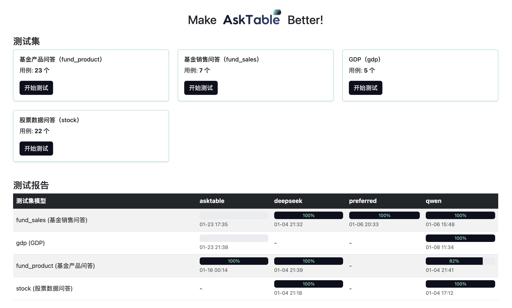
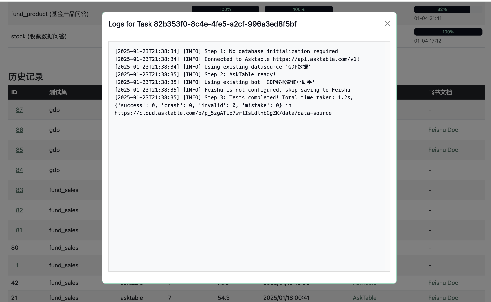
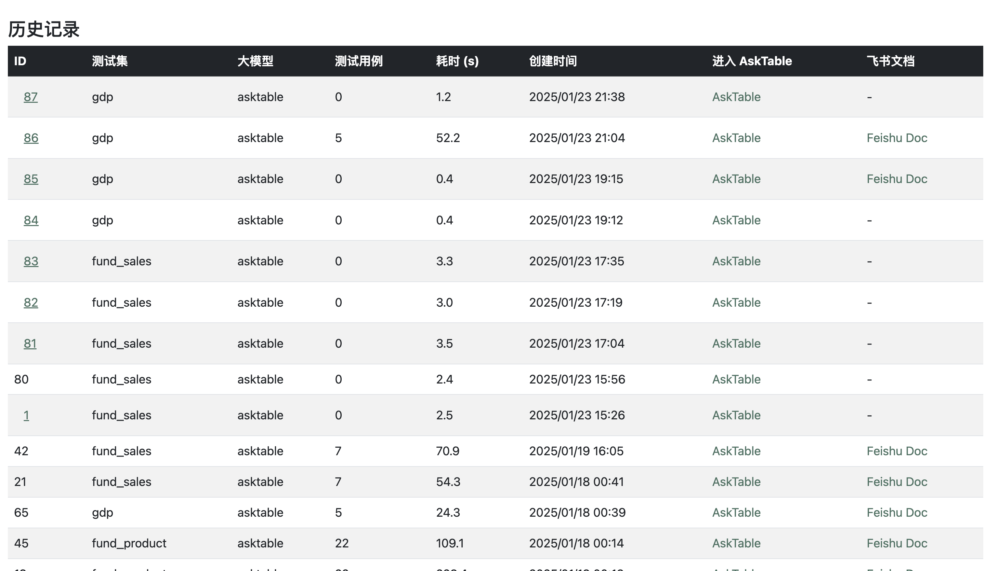
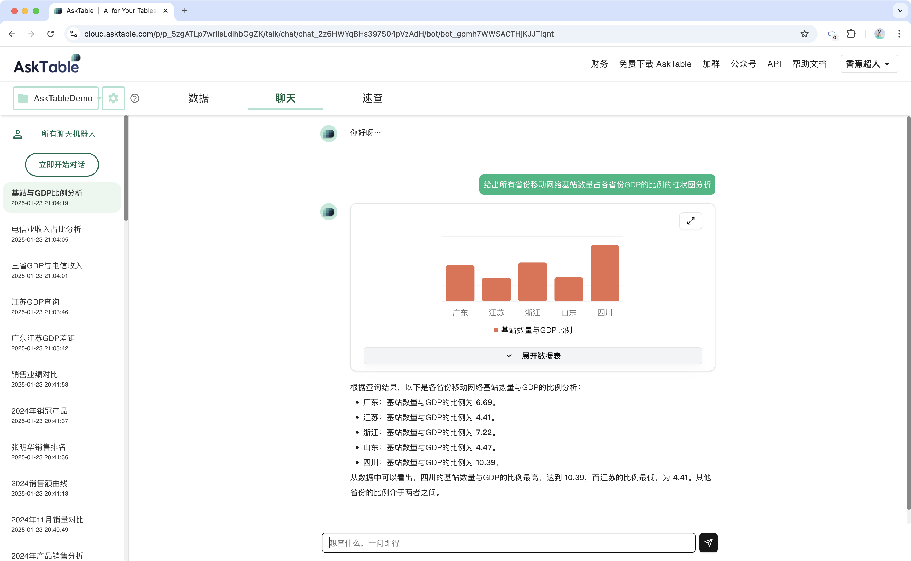

# Make AskTable Better

[English](./README_EN.md)

**让 AskTable 更出色**

`asktable-better` 是一款简单易用的工具，旨在简化 AskTable 的测试流程，方便用户快速验证AskTable 是否能满足自己的业务需求。

它提供了一个简洁的用户界面，用于管理和执行测试集、查看日志以及分析测试报告。

它也提供了 Docker 镜像，支持私有化部署，用于测试本地部署的 AskTable。

---

## 功能

### 1. 查看测试集  
在主页轻松浏览可用的测试集。  


### 2. 执行测试  
选择一个测试集，点击即可开始测试。  
  
实时监控进度并查看测试日志。  


### 3. 分析测试报告  
查看详细的测试历史记录和报告。  


也可以跳转到 AskTable 实时查看回复内容与效果。

---

## 快速使用

按照以下步骤快速设置并开始使用。

### 步骤 1：创建 `docker-compose.yml` 文件  

```yaml
version: "3.8"
services:
  at-better-web:
    image: registry-vpc.cn-shanghai.aliyuncs.com/datamini/asktable-better
    ports:
      - "8000:8000"
    volumes:
      - ./stories:/stories
      - ./at-better-data:/at-better
```

### 步骤 2：添加测试用例  
将您的测试用例保存到 `stories` 目录中。详细指南请参考 [测试用例编写指南](./docs/STORY_README.md)。

### 步骤 3：启动服务  

运行以下命令以启动服务：

```bash
docker-compose up -d
```

服务启动后，在浏览器中访问 `http://localhost:8000` 即可使用。

---

## 高级功能

### 1. 使用 MySQL 作为数据库  

asktable-better 默认使用 sqlite 存储测试日志与结果数据，如果希望使用 MySQL，可以在 `docker-compose.yml` 文件中添加以下环境变量：

```yaml
environment:
  DATABASE_TYPE: mysql
  MYSQL_HOST: 127.0.0.1
  MYSQL_PORT: 3306
  MYSQL_DB: test
  MYSQL_USER: test
  MYSQL_PASSWORD: test
```

### 2. 将测试结果保存到飞书  

如果需要将测试结果保存到飞书，请在 `docker-compose.yml` 文件中添加以下环境变量：

```yaml
environment:
  FS_APP_ID: xxx    # 飞书应用ID
  FS_APP_SECRET: xxx    # 飞书应用密钥
  FS_WIKI_PARENT_TOKEN: xxx    # 飞书知识库父目录Token
  FS_WIKI_ID: xxx    # 飞书知识库ID
  FS_FILE_EXCHANGE_FOLDER_TOKEN: xxxxx    # 飞书文件上传的临时目录Token
  FS_WIKI_URL_PREFIX: https://xxx.feishu.cn/wiki/    # 飞书知识库URL前缀

```

---

## 贡献

我们欢迎社区贡献！如果您遇到任何问题或有改进建议，请随时提交 issue 或创建 pull request。


## 本地开发
1. 运行 `cp docker-compose-template.yml docker-compose.yml` 复制模板文件
2. 修改 `docker-compose.yml` 文件中的环境变量
3. 运行 `docker-compose up --build` 使用本地代码启动服务，然后访问 `http://localhost:8000` 即可使用。

---
让我们一起让 AskTable 更加出色！🚀
