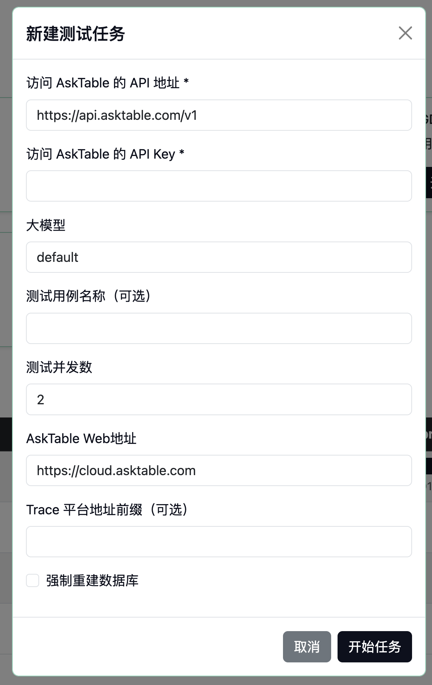
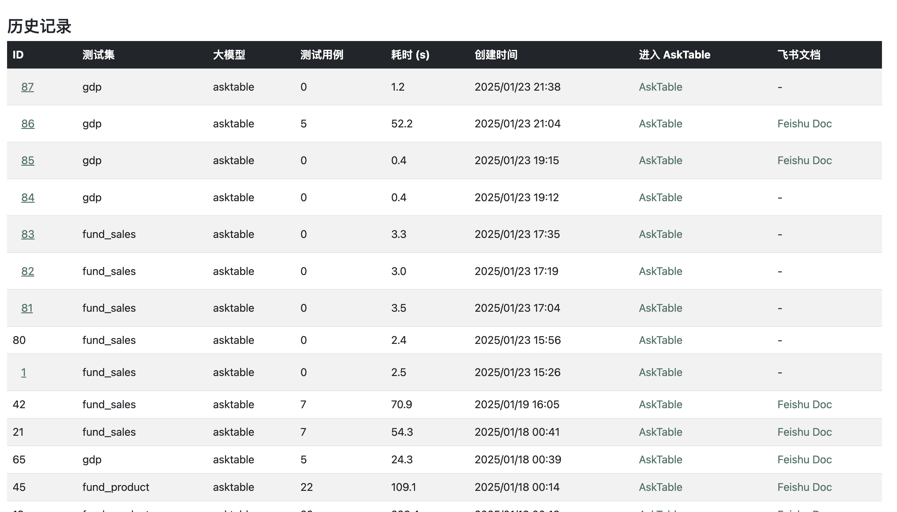

# Make AskTable Better

`asktable-better` is a lightweight yet powerful tool designed to simplify the AskTable testing process, making it easy for users to quickly validate whether AskTable meets their business needs. It provides a clean user interface for managing and executing test sets, viewing logs, and analyzing test reports.

---

## Features

### 1. View Test Sets  
Easily browse through available test sets on the home page.  


### 2. Execute Tests  
Select a test set and start testing with a single click.  
  
Monitor progress and view test logs in real time.  


### 3. Analyze Test Reports  
Review detailed test history and reports for better insights.  


You can also jump to AskTable to view the real-time reply content and effect.

---

## Quick Start

Follow these steps to quickly set up and start using `at-better-cli`.

### Step 1: Create the `docker-compose.yml` File  

```yaml
version: "3.8"
services:
  at-better-web:
    image: at-better-web
    ports:
      - "8000:8000"
    volumes:
      - ./stories:/stories
      - ./at-better-data:/at-better
```

### Step 2: Add Test Cases  
Save your test cases in the `stories` directory. For detailed guidelines, refer to the [Test Case Writing Guide](./docs/STORY_README.md).

### Step 3: Start the Service  

Run the following command to launch the service:

```bash
docker-compose up -d
```

Once the service is running, visit `http://localhost:8000` in your browser to access the web interface.

---

## Advanced Features

### 1. Use MySQL as the Database  

To use MySQL instead of the default database, update your `docker-compose.yml` file with the following environment variables:

```yaml
environment:
  DATABASE_TYPE: mysql
  MYSQL_HOST: 127.0.0.1
  MYSQL_PORT: 3306
  MYSQL_DB: test
  MYSQL_USER: test
  MYSQL_PASSWORD: test
```

### 2. Save Test Results to Feishu  

Automatically save test results to Feishu by adding the following environment variables to your `docker-compose.yml` file:

```yaml
environment:
  FS_APP_ID: xxx
  FS_APP_SECRET: xxx
  FS_WIKI_PARENT_TOKEN: xxx
  FS_WIKI_ID: xxx
  FS_FILE_EXCHANGE_FOLDER_TOKEN: xxxxx
  FS_WIKI_URL_PREFIX: https://xxx.feishu.cn/wiki/
```

---

## Contributions

We welcome contributions from the community! If you encounter any issues or have suggestions for improvement, feel free to submit an issue or create a pull request.

---

## License

This project is licensed under the [MIT License](./LICENSE).  

Let's make AskTable better, together! 🚀